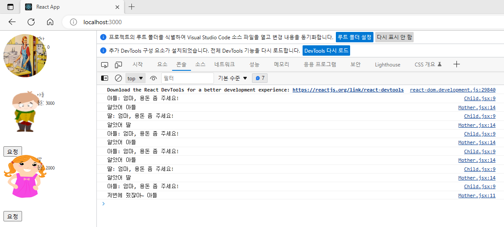

간단한 코드 조각들
=====
## 목차
1. 자바스크립트
    * [requestAnimationFrame](#requestAnimationFrame)
2. 리액트
    * [props로 이벤트 전달](#props로-이벤트-전달)
3. CSS

### requestAnimationFrame
```javascript
/**
 * 화면에 새로운 애니메이션을 업데이트할 준비가 될때마다 이 메소드를 호출하는것이 좋습니다.
 * 다음 리페인트에서 그 다음 프레임을 애니메이트하려면 콜백 루틴이 반드시 스스로 requestAnimationFrame()을 호출해야합니다.
 */
window.requestAnimationFrame(callback);
```

* 예제
    * JS] [날아가는 풍선](animation/ex1/requestAnimationFrame.html)
    * JS] [사용자 정의 성능 위젯](animation/fps/performanceMonitoringWidget.html)
* 문서
    * HTML5] [Web Animation API](https://sculove.github.io/slides/webAnimation/#/)
    * JS] [모듈 소개](https://ko.javascript.info/modules-intro)

##### [목차로 이동](#목차)

### props로 이벤트 전달
```txt
※ 리액트가 처음이라 미흡하나, 다음을 연습해보기 위해 작성해보았다.
- Description
  = 엄마는 한도 내에서 아들, 딸에게 용돈을 줄 수 있다.
  = 총 잔고 외에도 아들, 딸이 받은 용돈을 표시한다.
- Implement
  = 자식(아들, 딸)들이 용돈을 요청 시, 받은 용돈의 총 합계를 관리해야 하므로 
    데이터는 엄마(부모 컴포넌트)가 관리한다.
  = 이를 위해 props로 이벤트를 넘겨주어 부모의 잔고를 변경해준다.
  = 요청 후 잔고에 따라 용돈을 주는 행위는 부모에게 책임이 있으므로,
    해당 로직을 부모가 가지도록 하였다.
  = 엄마(부모 컴포넌트)가 용돈 요청 대상(자식 컴포넌트)에 대해 알아야 한다고 생각해서,
    용돈을 주기 전 대상을 부모에게 설정하는 로직(setTarget)이 있었다.
    하지만 render 되기 전이라 그런지 동기적으로 대상(target)이 설정되지 않아,
    엄마가 직접 해당 필드(target)를 갖고 있지 않도록 변경했다.
```



* 예제
  * [자식들에게 용돈 주기](pettycash/src/index.js)
* 문서
  * [틱택토 튜토리얼](https://react.dev/learn/tutorial-tic-tac-toe#lifting-state-up)

##### [목차로 이동](#목차)